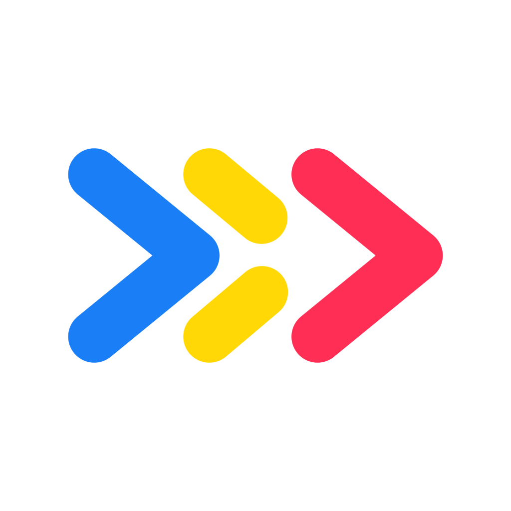

#  Observatory

[The Context Company](https://thecontextcompany.com/) does agent observability. **We care deeply about DX; it's our single biggest priority.**

Observatory is a monorepo containing core packages for AI agent observability across TypeScript and Python:

**TypeScript:**

- **[@contextcompany/otel](./packages/ts/otel)** - OpenTelemetry integration for instrumenting AI SDK calls
- **[@contextcompany/widget](./packages/ts/widget)** - Local-first UI overlay for visualizing AI agent traces in real-time
- **[@contextcompany/claude](./packages/ts/claude)** - Instrumentation for Claude Agent SDK
- **[@contextcompany/langchain](./packages/ts/langchain)** - Integration for LangChain.js and LangGraph
- **[@contextcompany/mastra](./packages/ts/mastra)** - Integration for the Mastra framework
- **[@contextcompany/custom](./packages/ts/custom)** - Manual instrumentation SDK for custom agents
- **[@contextcompany/openclaw](./packages/ts/openclaw)** - Integration for OpenClaw via OpenTelemetry
- **[@contextcompany/pi](./packages/ts/pi)** - Instrumentation for the Pi Agent SDK
- **[@contextcompany/api](./packages/ts/api)** - Shared API utilities (feedback, configuration)

**Python:**

- **[contextcompany](./packages/python)** - Python SDK with built-in integrations for LangChain, CrewAI, Agno, and LiteLLM

## MCP server

The Context Company ships a remote [MCP](https://modelcontextprotocol.io) server so coding agents and developer tools can query your production agent data directly — no dashboard round-trips. It is listed in the [official MCP registry](https://registry.modelcontextprotocol.io) as `io.github.The-Context-Company/context-company`.

```
https://api.thecontext.company/mcp
```

Ask questions like "what failed in production this week?", "which tool calls are creating bad outcomes?", or "which traces should become evals?" and get answers backed by the actual runs.

**Tools include:**

- `insight_search` - natural-language questions over your production traces, sessions, and patterns
- `get_agent_runs` / `get_agent_run` - list and inspect runs with full step and tool-call detail
- `get_agent_sessions` / `get_agent_session` - conversation-level views
- `list_agent_patterns` / `list_agent_topics` - recurring behavior patterns and auto-detected topics
- Config tools for managing tracked patterns, scheduled recaps, memories, and skills (OAuth)

**Connect from Cursor, Claude Code, or any MCP client** (transport is streamable HTTP; authenticate with OAuth or an API key as a bearer token):

```json
{
  "mcpServers": {
    "context-company": {
      "url": "https://api.thecontext.company/mcp"
    }
  }
}
```

See the [MCP documentation](https://docs.thecontextcompany.com/access-data/mcp) for authentication details and the full tool reference.

## Local mode (AI SDK + Next.js)

Local mode allows you to run The Context Company in a local-first way. This is 100% open-source and requires **no account or API key**. To set up local mode, refer to the guide below or [our documentation](https://docs.thecontextcompany.com/frameworks/vercel-ai-sdk#local-mode).

**Local mode currently only supports Vercel AI SDK on Next.js**.


### Setup

#### Step 1: Install dependencies

```Title pnpm
pnpm add @contextcompany/otel @vercel/otel @opentelemetry/api
```

#### Step 2: Add instrumentation to Next.js

If you haven't already, add an `instrumentation.[js|ts]` file in the **root directory** of your project (or inside the `src` folder if you're using one). Call the `registerOTelTCC` function to instrument your AI SDK calls.

See the [Next.js Instrumentation guide](https://nextjs.org/docs/app/guides/instrumentation) for more information on instrumenting your Next.js application.

```typescript instrumentation.ts
// instrumentation.ts
export async function register() {
  if (process.env.NEXT_RUNTIME === "nodejs") {
    const { registerOTelTCC } = await import("@contextcompany/otel/nextjs");
    registerOTelTCC({ local: true });
  }
}
```

#### Step 3: Add widget to layout

Add the Local Mode widget to the root layout of your Next.js application.

```tsx app/layout.tsx
// app/layout.tsx
import Script from "next/script";

export default function RootLayout({
  children,
}: {
  children: React.ReactNode;
}) {
  return (
    <html lang="en">
      <head>
        {/* add The Context Company widget */}
        <Script
          crossOrigin="anonymous"
          integrity="sha384-ryHylpN8vggwpf+rjl5Z7CGgpVWrEAXn6WTY/Kv2RhlixzrdTMCP3/DPS3RMtNCg"
          src="https://unpkg.com/@contextcompany/widget@1.0.8/dist/auto.global.js"
        />
        {/* other scripts */}
      </head>
      <body>{children}</body>
    </html>
  );
}
```

#### Step 4: Enable telemetry for AI SDK calls

As of AI SDK v5, telemetry is experimental and requires the `experimental_telemetry` flag to be set to `true`. Ensure you set this flag to `true` for all AI SDK calls you want to instrument.

```typescript generateText
// route.ts
import { generateText } from "ai";

const result = generateText({
  // ...
  experimental_telemetry: { isEnabled: true }, // required
});
```

> [!NOTE]
> By default, The Context Company collects limited anonymous usage data when running local mode. **No sensitive or personally identifiable information is ever collected**. You can view exactly which events and values are tracked [here](https://github.com/The-Context-Company/observatory/blob/main/packages/ts/otel/src/nextjs/telemetry/events.ts). To disable anonymous telemetry, set the `TCC_DISABLE_ANONYMOUS_TELEMETRY` environment variable to `true` in your Next.js project. Learn more about this in our [documentation](https://docs.thecontextcompany.com/frameworks/vercel-ai-sdk#local-mode).

## Examples

Check out the [examples/](./examples) directory for working demos across all supported frameworks:

| Example                                         | Framework                 | Language   |
| ----------------------------------------------- | ------------------------- | ---------- |
| [nextjs-widget](./examples/nextjs-widget)       | AI SDK + Local Widget     | TypeScript |
| [nextjs-aisdk](./examples/nextjs-aisdk)         | AI SDK + Cloud Mode       | TypeScript |
| [claude-agent-sdk](./examples/claude-agent-sdk) | Claude Agent SDK          | TypeScript |
| [langchain-ts](./examples/langchain-ts)         | LangChain / LangGraph     | TypeScript |
| [mastra](./examples/mastra)                     | Mastra                    | TypeScript |
| [custom-ts](./examples/custom-ts)               | Custom Instrumentation    | TypeScript |
| [openclaw](./packages/ts/openclaw)              | OpenClaw (OTLP Collector) | TypeScript |
| [pi](./packages/ts/pi)                          | Pi Agent SDK              | TypeScript |
| [langchain](./examples/langchain)               | LangChain                 | Python     |
| [crewai](./examples/crewai)                     | CrewAI                    | Python     |
| [agno](./examples/agno)                         | Agno                      | Python     |
| [custom-python](./examples/custom-python)       | Custom Instrumentation    | Python     |

### Contributing

- Looking to contribute? Check out our [contributing guide](./CONTRIBUTING.md) to get started.

### Acknowledgments

- Big thanks to [Anthony Hoang](https://github.com/anth0nycodes) and [Eric Zhang](https://github.com/Eric-Zhang-Developer) for being active contributors!
- Special thanks to [@RobPruzan](https://github.com/RobPruzan) for helping with the design of the tool and being an early adopter.
- [React Scan](https://react-scan.com/) has a phenomenal DX and Preact widget that we took inspiration from.
- The implementation behind the [Next.js Devtools](https://github.com/vercel/next.js/tree/canary/packages/next/src/next-devtools) overlay widget was insightful.
